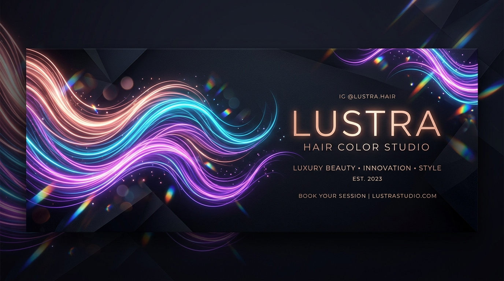

<div align="center">

# Lustra - Live AI Hair Color Studio

<p align="center">
  <strong>Try on any hair color live on your camera or photo with zero server upload.</strong><br>
  Instant, realistic, private, on-device AI hair dye simulation in your browser.
</p>

[](https://r2dapps.github.io/lustrahairstudio/)
[](https://r2dapps.github.io/lustrahairstudio/)
[](https://r2dapps.github.io/lustrahairstudio/)
[](https://ai.google.dev/edge/mediapipe)

<br />



</div>

---

## Highlights

- **Live Full Camera Mode:** Immersive, full-screen camera preview with zero distortion and true aspect ratio preservation on both mobile and desktop.
- **Solid and Ombre Color Engines:**
  - **Solid:** Natural full coverage with realistic strand highlights and hair shine preserved.
  - **Ombre:** Smooth vertical gradient flowing from roots to tips.
- **Custom Color Palette:** Beyond the 20 curated salon shades, pick any custom hex or RGB color with the live custom palette tool.
- **Photo Upload and Drag-and-Drop:** Upload any selfie or portrait (JPG/PNG) or drag-and-drop it directly into the studio.
- **Interactive Before/After Slider:** Smooth drag comparison slider with touch and keyboard navigation to compare natural hair against the dye preview.
- **Dedicated Camera Shutter:** One-tap capture button floating above the shade carousel with instant visual feedback.
- **100% Client-Side Privacy:** Your camera feed and photos never leave your device. No servers, no tracking, and no account required.
- **Progressive Web App (PWA):** Install Lustra directly to your home screen or desktop for a native-app experience.

---

## Live Demo

Open the live studio in any modern browser:

[https://r2dapps.github.io/lustrahairstudio/](https://r2dapps.github.io/lustrahairstudio/)

Camera access requires an HTTPS connection (automatically provided by GitHub Pages) or localhost.

---

## Installing as a PWA

Lustra is a fully compliant Progressive Web App with offline caching support.

### iPhone and iPad (Safari)
1. Open the studio link in Safari.
2. Tap the Share button (square with an arrow pointing up).
3. Scroll down and tap "Add to Home Screen".
4. Tap "Add". Lustra will now open in fullscreen with no browser bars.

### Android (Chrome / Brave / Edge)
1. Open the studio link in Chrome.
2. Tap the "Install App" banner or open the menu and select "Install app" / "Add to Home screen".
3. Launch Lustra from your home screen or app drawer.

---

## Curated Shade Palette

| Category | Available Looks |
| :--- | :--- |
| **Natural Coverage** | Jet Black, Soft Black, Dark Brown, Honey Blonde |
| **Glow and Warmth** | Rose Gold, Cherry Cola, Copper, Sunset |
| **Fantasy and Brights** | Neon Pink, Cotton Candy, Mermaid, Violet Haze, Cyber Blue, Emerald, Galaxy, Rainbow |
| **Cool and Ash** | Platinum, Silver, Snow White |
| **Custom Shade** | Live Hex/RGB color picker tool (+ swatch) |

---

## Architecture and Engine

```
   [Camera Feed / Photo]
            │
            ▼
 [MediaPipe Multi-Class Segmenter] ──► Extracts per-pixel hair confidence mask
            │
            ▼
  [Temporal Mask Stabilization]   ──► Smoothes frame-to-frame jitter and softens edges
            │
            ▼
   [Multi-Pass Dye Engine]        ──► Color pass (hue and saturation)
                                      Soft-light pass (depth and shine)
                                      Screen lift (pale shades) / Multiply (deep shades)
            │
            ▼
[Real-Time Canvas Compositing]    ──► High-performance GPU-accelerated preview
```

1. **Pixel-Level Hair Segmentation:** MediaPipe lightweight multiclass selfie segmenter labels every pixel at 60 FPS directly on the GPU/WASM.
2. **Strand Preservation:** Rather than a flat overlay, Lustra blends color through multiple composite passes (color, soft-light, screen, and multiply), preserving natural hair shadows, shine, and depth.
3. **Responsive Full-Camera Framing:** Smart geometry framing ensures full-screen edge-to-edge camera coverage on mobile phones with zero aspect ratio distortion.

---

## Local Development

Run Lustra locally with any static HTTP server:

```bash
# Clone the repository
git clone https://github.com/r2dapps/lustrahairstudio.git
cd lustrahairstudio

# Run with Python 3
python -m http.server 8000

# Or run with Node.js
npx serve -p 8000 .
```

Open http://localhost:8000 in Chrome, Edge, or Safari.

---

## SEO and Social Link Previews

Lustra is preconfigured with complete Open Graph, Twitter Cards, and Schema.org metadata:
- **WhatsApp, iMessage and Telegram:** Rich media previews with the 1200x630 luxury banner.
- **Twitter / X:** Large card format with verified description and title tags.
- **Search Engines:** Semantic HTML5 and JSON-LD structured data for fast indexing.

---

## License and Credits

- Built with Google MediaPipe Tasks Vision.
- Distributed under the MIT License. Free for personal and educational use.
